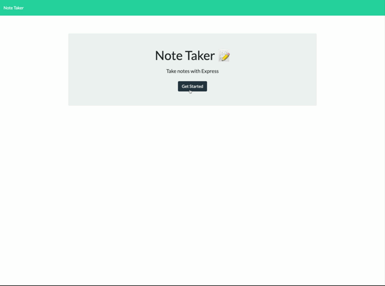

# Note Taker


## Description

---

An application that may be used to create, save, and retrieve notes.

## Table of Contents
- [Install](#install)
- [Usage](#usage)
- [Tests](#tests)
- [Questions](#questions)
- [Contributing](#contributing)
- [License](#license)

## Install

---

### This app can be run locally or on Heroku

#### To run this app locally:

1. Clone this repo
    ```
    git@github.com:wilmararturo/note-taker.git
    ```
1. Run the app.
    ```
    node server
    ```
1. Navigate to [local Note Taker app]( http://localhost:3000)

#### To run this app from Heroku

- Navigate to [Note Taker App]()

## Usage

---

1. Open the app.
1. Click the get started button.
1. Create, save, or delete notes as desired.



## Tests

---

n/a

## Questions

---

Contact:

[wilamrarturo](https://github.com/wilamrarturo) on GitHub

[e-mail](mailto:wilamrs@gmail.com)

## Contributing

---

Create a pull request.

## License

---

Licensed under the [MIT License](https://api.github.com/licenses/mit)